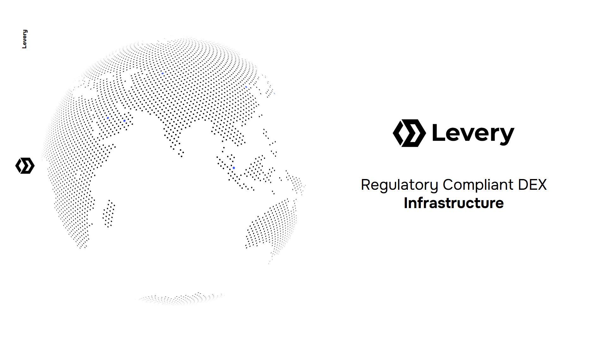

# Levery Whitepaper

## Abstract

<figure><figcaption></figcaption></figure>

Levery is a decentralized exchange (DEX) initiative designed to bridge the compliance gap between traditional financial institutions and the burgeoning DeFi market. Leveraging Uniswap V4 hook functionalities and advanced market prices oracles, Levery ensures financial institutions can engage in DeFi transactions securely, adhering to stringent AML, KYC, and compliance frameworks. By implementing dynamic fees and integrating robust price comparison systems, Levery mitigates impermanent loss and maximizes liquidity returns, potentially enhancing earnings for liquidity providers up to twentyfold. This system provides a compliant, profitable, and secure environment for financial institutions to exploit DeFi opportunities without compromising regulatory obligations.


Levery was developed during the **Uniswap Hook Incubator** / HOOKATHON Cohort 1, an 8-week program by Atrium Academy aimed at advancing DeFi development through Uniswap V4's hooks. Supported by a grant from the **Uniswap Foundation**, this initiative helps developers like the Levery team build enhanced DeFi solutions.


> Levery is currently implemented on the **Sepolia Testnet**, allowing users to interact with the platform in a test environment: [https://test.levery.org](https://test.levery.org/)
