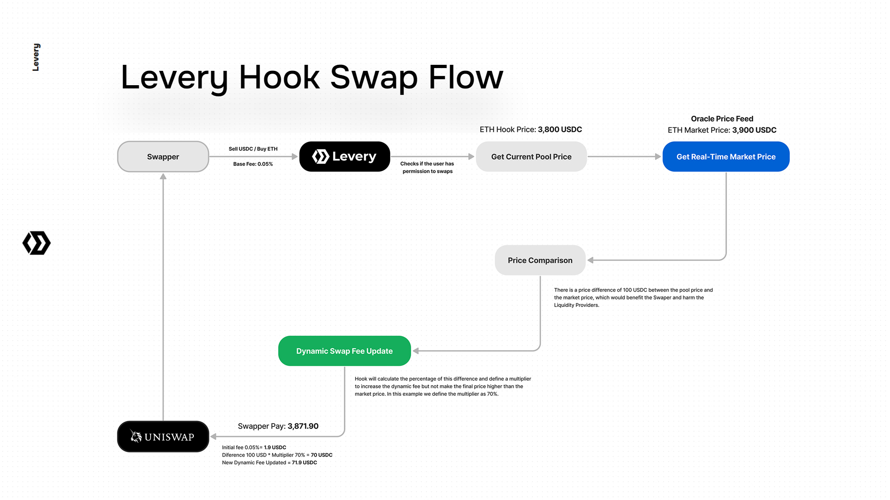

# Levery Hook

## **Levery’s Strategic Use of Uniswap V4 Hooks**

Levery's hook contract, built atop the Uniswap V4 framework, incorporates a variety of sophisticated features designed to facilitate dynamic fee management, enforce compliance through permissions, and integrate with price feed oracles. Core components that harness the power of decentralized finance technology to enhance functionality, compliance, and efficiency, critical for institutional adoption and regulatory approval.

<figure><figcaption></figcaption></figure>

### Mitigation of Impermanent Loss

Hooks provide Levery with the ability to dynamically adjust transaction fees based on real-time market data sourced from oracles. By aligning fees with current market dynamics, Levery helps protect liquidity providers from impermanent loss. This is achieved by adjusting the fees in response to price fluctuations and market conditions, ensuring that liquidity providers are adequately compensated.

### Enhanced Liquidity Provider Returns

The dynamic adjustment of fees ensures that liquidity providers can maximize their returns under varying market conditions. By tailoring fees to reflect real-time data, Levery creates a more attractive environment for liquidity providers, promoting deeper and more stable liquidity pools.

### Compliance Requirements

Levery utilizes the `PermissionManager` component to enforce compliance controls over who can participate in swaps and liquidity operations. This capability, enabled by the flexibility of Uniswap V4 hooks, integrates comprehensive Know Your Customer (KYC) and Anti-Money Laundering (AML) checks directly into the transaction flow. By ensuring that only verified and compliant users can engage in trading and liquidity activities, Levery aligns with regulatory standards and mitigates potential compliance risks.

**Fraud Detection and Response:** A critical strategic use of the hooks is the ability to freeze liquidity or block swaps for specific users if fraud is detected. For instance, if a compliance risk is identified or if there is a request from authorities to block a user, Levery can temporarily halt that user's ability to perform swaps or add/remove liquidity. It is important to note that while Levery can restrict actions to maintain compliance and security, the protocol does not allow the use or transfer of users' funds without their consent.

### Operational Efficiency

Uniswap V4’s architecture, supported by hook functionalities, significantly enhances operational efficiency for Levery. The Singleton contract model consolidates all pools into a single contract, which reduces the gas costs and complexity associated with deploying multiple contracts. This results in faster and more cost-effective execution of complex multi-step transactions, benefiting users and liquidity providers alike.

## Levery Hook Core Components

### Uniswap V4 BaseHook Integration

The Levery contract extends `BaseHook` from Uniswap V4's periphery, which is a foundational component allowing the integration of custom logic at specific points in the liquidity pool lifecycle. This enables Levery to implement custom behaviors for trading actions, such as swaps and liquidity management.

The hooks (`beforeSwap`, `beforeAddLiquidity`, `beforeRemoveLiquidity`) are crucial for pre-transaction checks and adjustments. They allow Levery to:

* Enforce permissions dynamically.
* Adjust fees based on current market data and predefined rules.
* Ensure transactions are only executed when all compliance and risk management criteria are met.

### Permission Manager

A vital component of Levery's contract is the `PermissionManager`. This module controls access to liquidity provision and swap actions, ensuring that only authorized users can perform these operations. It plays a critical role in maintaining compliance with regulatory standards, thereby ensuring that all trading activities align with legal requirements.

### Dynamic Fee Structure

At the heart of Levery's trading mechanism is the dynamic fee structure, governed by variables such as `baseFee` and `lpFeeMultiplier`. These parameters are adjustable by the admin and are used to calculate trading fees based on current market conditions and pool-specific settings.

* `baseFee`: Represents the default fee percentage for swaps within the pools, set by the admin.
* `lpFeeMultiplier`: Used to adjust the liquidity provider's fee share, allowing fees to be responsive to market dynamics and volatility.

### Pool-Specific Oracle Integration

Each liquidity pool can be assigned its specific price feed oracle through a mapping `poolOracles`), which stores oracle addresses and comparison flags to ensure price accuracy for fee calculations. This setup enables the contract to fetch real-time data to make informed decisions on fee adjustments.

### **Pool Settings**

Levery's architecture includes the ability to tailor settings for individual pools via mappings that link pool identifiers to specific configurations:

* `poolBaseFees`: Maps pool identifiers to customized base fees for each pool, allowing for tailored fee structures that can adapt to the unique characteristics of each token pair.
* `poolOracles`: Links each pool to a designated oracle, facilitating accurate price feeds that are crucial for setting appropriate swap fees and mitigating arbitrage risks.

### Enhanced Price Calculation

Each pool can be associated with a price feed oracle, specified in the `PoolOracle` struct, which includes the oracle address and a flag indicating whether to compare against `price0` or `price1`.&#x20;

Utilizing Chainlink's `AggregatorV3Interface` and internal libraries like `TickMath` and `FullMath`, the contract calculates precise token prices within a pool. This integration allows Levery to fetch real-time price data and is crucial for maintaining balance in response to market movements.

* `getLastOraclePrice`: Fetches the latest price from a specified price feed oracle, adjusting for token decimals to ensure consistency across different assets.
* `getCurrentPrices`: Calculates current prices within a pool, using advanced mathematical libraries like `TickMath` and `FullMath` to ensure precision.

### Admin Controls

The contract is equipped with administrative functions that allow for high-level control and configuration:

* `setAdmin` and `updateAdmin`: Functions to set and update the administrator's address.
* `updateBaseFee` and `setPoolBaseFee`: These functions allow the admin to adjust fee parameters globally or per pool, responding to evolving market dynamics.
* `setPermissionManager`: Assigns a new `PermissionManager`, updating the contract's access control logic.


Levery Hook GitHub Repository: [https://github.com/levery-org/levery-hook](https://github.com/levery-org/levery-hook)

