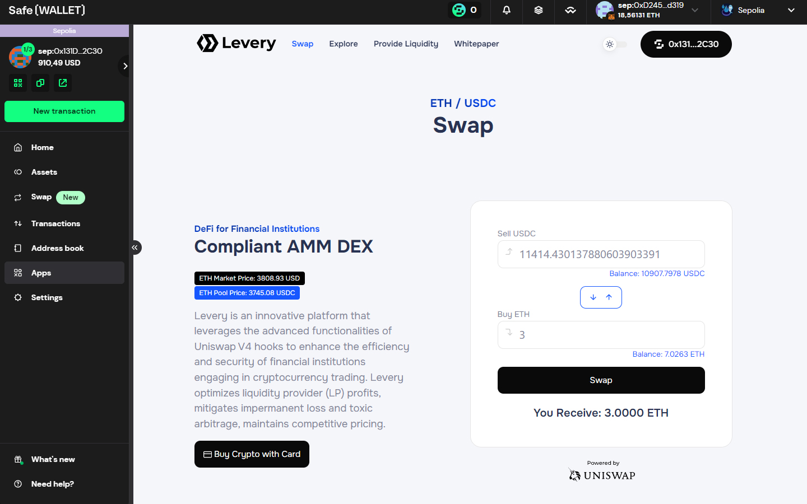

# Safe App

### Levery Safe App

The **Levery DEX** Safe App allows users to easily connect and interact with Levery using their Safe Account. This integration ensures that users can manage their digital assets securely and efficiently, leveraging the robust features of Safe’s trusted platform.

<figure><figcaption></figcaption></figure>

**Advantages:**

* **Multisig Security:** Leveraging Safe’s multisig capabilities, users can ensure that transactions require multiple approvals, enhancing security and reducing the risk of unauthorized actions.
* **Seamless Integration:** Users can interact with Levery directly from the Safe interface, making it easier to manage assets and perform transactions without switching between different platforms.

### How to Access Levery Safe App

Follow these steps to add and access the Levery Safe App:

1. **Access Safe Apps:**
   * Go to [Safe Apps](https://app.safe.global/apps).
2. **Add Custom Safe App:**
   * Click on the "My custom apps" tab.
   * Then, click the "Add custom Safe App" button.
3. **Enter Levery Safe App URL:**
   * In the "Safe App URL" field, enter: `https://test.levery.org`.
   * The Levery DEX will be immediately identified.
4. **Agree to Terms:**
   * Check the box stating, "This Safe App is not part of Safe{Wallet} and I agree to use it at my own risk."
5. **Add Levery Safe App:**
   * The "Add" button will be enabled. Click it to add Levery DEX to your custom apps.
6. **Use Levery Safe App:**
   * Levery DEX will now be available in your custom apps, ready to be used with your Safe{Wallet}.

> Levery is currently implemented on the **Sepolia Testnet**, allowing users to interact with the platform in a test environment.

### **What is Safe?**

Safe (prev. Gnosis Safe) is a widely trusted platform for managing digital assets on Ethereum and multiple EVM-compatible blockchains. It offers a secure, user-friendly interface for handling cryptocurrency and digital asset transactions, ensuring high levels of security and convenience.

### **What is Safe{Wallet}?**

Safe{Wallet} is a multi-signature (multisig) wallet solution provided by Safe. It allows users to require multiple signatures for executing transactions, adding an extra layer of security. This multisig capability ensures that no single user can unilaterally perform actions, protecting against unauthorized access and enhancing overall security.

### **What is a Safe App?**

Safe Apps are decentralized applications that integrate seamlessly with the Safe interface. They enable users to interact with various Dapps directly from the Safe dashboard. This integration streamlines the user experience, allowing for secure and efficient management of digital assets and transactions within the Safe environment.


Safe Docs: [https://docs.safe.global/home/what-is-safe](https://docs.safe.global/home/what-is-safe)

Safe Account: [https://app.safe.global/welcome](https://app.safe.global/welcome)

Safe Apps: [https://app.safe.global/apps](https://app.safe.global/apps)

